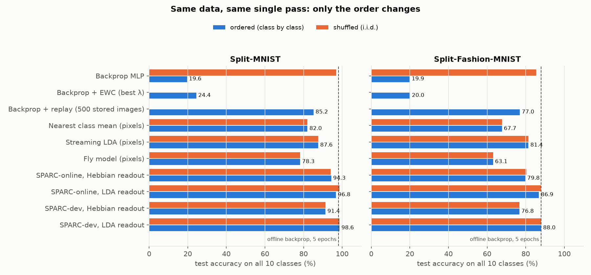
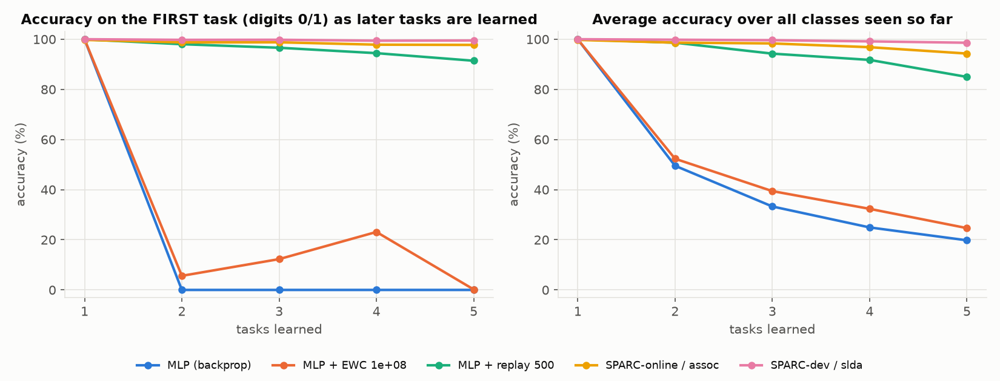
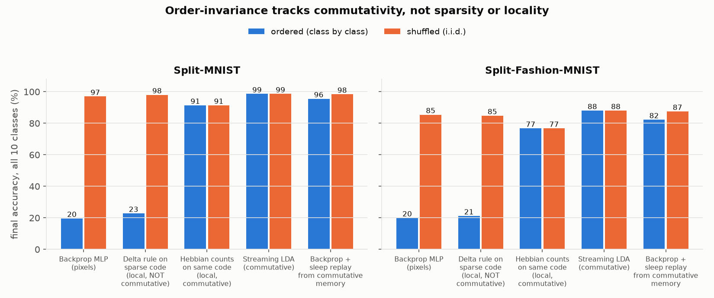
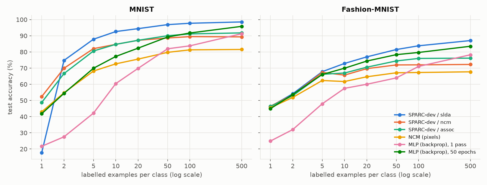
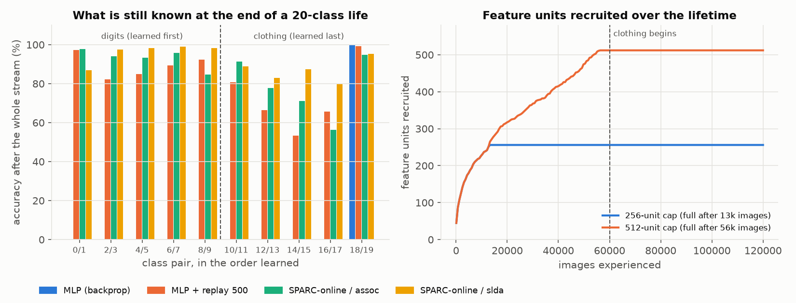

# The Real Bottleneck: AI Cannot Learn in the Order That Life Happens

**What this file is:** an argument for what the deepest bottleneck between today's AI and a
human-like learner is, a mechanism-level explanation of *why* it exists, a working learner built
to remove it, and measurements on real data comparing that learner with standard methods. Every
number here is produced by code in this repository (`run_experiments.py`, NumPy only, CPU).

**What this file is not:** it is not AGI, and it does not claim to be. A claim of "AGI solved" in a
single session could not be verified by anyone, including me, so I did not make it. What I did do
is below, and every result can be checked.

---

## 0. Bottom line

**The bottleneck.** A human learns from one continuous, *ordered* stream of experience: one pass,
no shuffling, no re-reading everything they ever saw, and without erasing old skills when learning
new ones. Every frontier AI system learns the opposite way: humans collect trillions of tokens,
**shuffle them**, train once, and **freeze the weights**. After deployment the model does not learn
from its own experience at all; in-context "learning" disappears when the context window ends.

The root cause is mechanical and can be stated precisely: **gradient updates to shared weights do
not commute.** The result of learning A then B is different from learning B then A, and when
experience arrives in order, later learning overwrites earlier learning (catastrophic forgetting).
The only reliable fix known at scale is to destroy the order by shuffling (or replaying)
everything offline.
That single fact forces the whole shape of modern AI: the train/deploy split, the data wall,
the compute bill, "memory" bolted on as context and retrieval, and agents that do not get better
at their jobs.

**The principle.** A learner is immune to the order of its experience exactly when its updates
commute, which is what happens when learning is *accumulating sufficient statistics* (adding
things up) over a representation that stays stable where memories depend on it. Brains appear to
do this with sparse Hebbian storage plus consolidation, and to use sleep replay to feed the
slow, non-commuting cortical learner interleaved data. Modern AI has only the slow learner; the
"sleep replay" is done by hand, offline, by humans shuffling the internet.
**Pretraining is humanity doing the brain's consolidation step manually.**

**What I built and measured.** SPARC is a learner with no backprop anywhere. Its feature layer
learns with local rules, and its memory is a commutative readout: either a fully local Hebbian one
or streaming LDA. It learns in a single pass and stores no examples. On class-incremental streams
(classes arrive in order, no task labels at test time):

| One pass, class-incremental, no task labels, no stored examples | Ordered stream | Same data shuffled |
|---|---|---|
| Backprop MLP, MNIST | **19.6%** | 97.0% |
| SPARC-online, fully local Hebbian readout, MNIST | **94.3%** | 94.1% |
| SPARC-online, LDA readout, MNIST | **96.8%** | 98.6% |
| SPARC-dev (developmental features), LDA readout, MNIST | **98.6%** | 98.6% |
| *Offline backprop, 5 shuffled epochs (upper bound), MNIST* | – | *98.0%* |
| Backprop MLP, Fashion-MNIST | **19.9%** | 85.5% |
| SPARC-online, LDA readout, Fashion-MNIST (hyperparameters never tuned on it) | **86.9%** | 87.8% |

- **A 20-class "lifetime"** (all ten digits, then all ten clothing classes, one pass): backprop
  learning in order ends at **10.0%**, knowing only the last task. SPARC-online learning in order ends at
  **91.4%**, matching backprop trained on the *shuffled* stream (91.0%).
- **Sleep works.** A standard backprop network trained on the ordered stream goes from **19.5% to
  95.5%** on MNIST (and from 20.0% to 82.2% on Fashion-MNIST) when, between tasks, it rehearses
  pseudo-examples generated from the commutative memory's statistics. No image is ever stored.
- **Few-shot.** After 10 labelled examples per class, in one pass, SPARC-dev scores **92.6%** on
  MNIST and 72.9% on Fashion-MNIST. Backprop from scratch, given 50 epochs on the same examples,
  scores 77.2% and 69.9%. (SPARC-dev has the advantage of unlabeled developmental features; see
  Section 5.6.)

**The single most informative experiment** (Section 5.3) holds the sparse code, the locality and
the data fixed, and changes only whether the update rule commutes. Counting: ordered = shuffled to
four decimals. Error-driven delta rule: 98.0% shuffled, **22.8% ordered** (MNIST, 3 seeds). So
sparsity is not what protects memory. Commutativity is.

**Is this new?** The ingredients are not, and Section 7 lists who got there first (ART 1987,
complementary learning systems 1995, fruit-fly associative learning 2021–23, streaming LDA 2020,
sparse memory finetuning for LLMs 2025). What this note contributes is (a) a sharp diagnosis
that puts **update commutativity and representation stability** at the root, rather than
"forgetting" as a symptom, (b) a controlled experiment that isolates commutativity from sparsity,
(c) a measured account of the growth-vs-stability tension, and (d) a concrete, falsifiable
research program for doing this in large models (Section 8).

---

## 1. What "a brain like a human" requires, stated from first principles

Leave aside benchmarks and ask what a human learner actually does:

1. **Learns from a stream it does not control.** Experience arrives in whatever order life
   serves it, heavily non-i.i.d.: a whole summer of swimming, then a semester of algebra.
2. **Learns in one pass.** Nobody re-reads every page they have ever read before learning the
   next thing.
3. **Keeps what it learned.** Learning algebra does not erase swimming.
4. **Never stops.** There is no "training phase" and "deployment phase"; acting and learning are
   the same process.
5. **Learns from little data.** Children hear on the order of tens of millions of words by age
   ten (Frank 2023, citing Hart & Risley); frontier LLMs train on 15–36 *trillion* tokens
   (Llama 3: ~15T; Qwen3: 36T). That is a gap of roughly **5 orders of magnitude** (Frank 2023
   estimates 4–5; the corpus sizes above put it at 5–6).
6. **Runs on ~20 W** (Balasubramanian 2021).

Chollet (2019) defines intelligence as *skill-acquisition efficiency*. By that measure,
properties 1–5 are not side features. They are the thing itself.

## 2. The bottleneck

### 2.1 The mechanism: learning updates that do not commute

Model a learner as a state θ and an update rule θ ← U_z(θ) applied to each experience z.
After a stream z₁ … zₙ the state is θₙ = U_{zₙ} ∘ … ∘ U_{z₁}(θ₀).

For stochastic gradient descent, U_z(θ) = θ − η∇ℓ(θ; z). Expanding two steps to second order:

```
U_a(U_b(θ)) − U_b(U_a(θ)) = η² ( H_a ∇ℓ_b − H_b ∇ℓ_a ) + O(η³)
```

where H_a is the Hessian of the loss on example a. The commutator is non-zero whenever
the curvature of one example acts on the gradient of the other, i.e. whenever they share
parameters that matter to both. In a dense network every example shares every weight. Over a
long ordered stream these second-order terms do not average out; they tend to accumulate in
one direction (toward whatever is being learned now). That accumulation *is* catastrophic
forgetting (McCloskey & Cohen 1989; French 1999), and its long-run cousin is loss of
plasticity (Dohare et al., *Nature* 2024).

Measured here (Section 5): the same network on the same 60,000 MNIST images in one pass is
**97.0% accurate if the images are shuffled and 19.6% if they arrive class by class.**
Nothing changed but the order. (The claim that the cross-terms accumulate rather than cancel is
an intuition from the expansion; the measurement is what establishes it here.)

This diagnosis is not idiosyncratic. In 2025, Andrej Karpathy, Ilya Sutskever and Richard Sutton
each publicly named continual learning, or learning from experience with human-like efficiency, as the key
missing capability (interviews on the Dwarkesh Patel podcast; Silver & Sutton, "Welcome to the
Era of Experience", 2025). What this note adds is a mechanism-level account of *why* it is
missing, and a controlled experiment that isolates that mechanism.

### 2.2 Everything else people call "the bottleneck" is downstream of this

| Commonly named bottleneck | How it follows from non-commuting updates |
|---|---|
| **Data wall** / need for trillions of tokens | If you cannot learn incrementally, every new skill means retraining on everything, and you need i.i.d. coverage of everything up front. |
| **Compute / energy cost** | Every update touches every weight (dense, global credit assignment), and the whole corpus must be revisited. |
| **No memory across sessions; context-window limits** | Weights are frozen after training because updating them in deployment would cause forgetting. So "memory" is pushed into the context window, which is bounded working memory, not learning. |
| **Agents don't get better at their job** | Same cause: experience from deployment cannot be written into the weights safely. |
| **Stale knowledge, expensive updates** | A new fact means finetuning, which damages other knowledge, or retrieval, which is a lookup, not integration. |

### 2.3 Why not the other candidates

- **"Compute / scale."** Scale helps: larger pretrained models forget less (Ramasesh et al.
  2022). But the train-then-freeze architecture is unchanged at every scale ever deployed.
  Scale moves the constant, not the shape.
- **"Data."** Running out of human text is a real constraint, but it is a *symptom* of 5 orders of
  magnitude of sample inefficiency, and that inefficiency is partly a consequence of not being able
  to learn incrementally from experience.
- **"Harness / context engineering / memory files."** These are workarounds for frozen weights:
  they store experience outside the learner. They are useful engineering, but they do not change
  what the learner itself can learn.
- **"Reasoning."** RL on reasoning traces made models much better at thinking inside one
  episode. It did not make them learn *across* episodes after deployment.
- **"A new programming language."** The bottleneck is in the learning rule, not in how code is
  written. A new language does not change whether updates commute, so I did not build one.

### 2.4 The strongest counter-arguments (and my honest read of them)

- **Forgetting shrinks with scale** (Ramasesh, Lewkowycz & Dyer, ICLR 2022), and **on-policy RL
  forgets less than supervised finetuning** ("RL's Razor", Shenfeld et al. 2025). *Read:* both
  reduce the commutator; neither removes it. They are evidence that the problem is the size of
  the cross-terms, which is exactly what this note says to attack.
- **In-context learning plus external memory might be enough.** Press coverage in 2026 attributes
  large ARC-AGI-3 gains to in-context adaptation and harness memory rather than weight updates (I
  could not verify those reports directly). *Read:* a real possibility. It is also, precisely, a
  commutative memory (append to a store, read by attention) bolted outside the network, which
  supports the principle while disputing where it must live. Whether context-plus-retrieval
  scales to a lifetime of accumulated skill, rather than facts, is the open empirical question.
- **The sample-efficiency gap is about priors, grounding and social learning** (Frank 2023).
  *Read:* likely partly true, and a system with perfect continual learning still needs good
  priors. My claim is that without commuting updates you cannot even *use* sequential experience
  efficiently, so you are forced to fake experience with shuffled, enormous datasets.

---

## 3. The principle: commutative memory over a consolidating representation

**Proposition 1 (order invariance).** If all updates commute (U_a ∘ U_b = U_b ∘ U_a), the final state
is independent of the order of experience. So a class-ordered stream produces *exactly* the
same model as a shuffled one: zero forgetting relative to i.i.d. training.
*Proof:* any permutation is a product of adjacent swaps, and each swap leaves the composition unchanged.

**Proposition 2 (what commutes).** Additive updates U_z(θ) = θ + φ(z) commute. That covers class
means, co-occurrence counts, second-moment matrices, Hebbian count matrices, and more generally
any exponential-family sufficient statistic. Exact Bayesian updating also commutes (the posterior is
the prior times a product of likelihoods), which is why approximate Bayesian continual learning
works as well as its approximation does (Nguyen et al., VCL, 2018).

**Proposition 3 (what sparsity does and doesn't do).** If U_a and U_b touch disjoint parameter sets
and each reads only its own set, they commute. k-winners-take-all sparse codes make parameter sets
mostly disjoint *for dissimilar inputs*. But in a class-incremental stream the new classes share
features with the old ones (strokes, edges), their codes overlap, and an error-driven rule on
overlapping codes pushes the old classes down. **Sparsity reduces the commutator; it does not
remove it.** Section 5.3 measures this directly.

**Proposition 4 (representation drift).** If memories are stored as statistics of φ_t(z) and the
representation later changes to φ_T, memory is read through the wrong coordinates. The error is
bounded by how far φ moved on the inputs that the memories depend on. Two special cases matter:
(a) old units changing their tuning, which consolidation prevents, and (b) *new* units that respond to old inputs,
which makes old memories look as if they had zeros in those coordinates. Section 5.4 shows (b)
is the dominant effect, and that winner-take-all encoding largely removes it.

**The resulting design rule:**
> *Store memories as commutative sufficient statistics; compute discrimination from those
> statistics at read time rather than baking it in with non-commuting error-driven updates; and
> keep the representation stable wherever stored memories depend on it, adding capacity by
> recruitment rather than by overwriting.*

**How a brain appears to implement this** (hypothesis, consistent with known neuroscience):
sparse, pattern-separated codes (e.g. dentate gyrus, fly mushroom body) with Hebbian,
associative storage for fast learning; synaptic consolidation and critical periods for
representational stability; and **sleep replay**, which interleaves old and new memories to train
the slow, error-driven cortical learner (complementary learning systems: McClelland,
McNaughton & O'Reilly 1995; Kumaran, Hassabis & McClelland 2016). Replay exists because the
slow learner does not commute. The brain shuffles its own experience, at night, from a memory that
does commute. Current AI has no fast commutative memory in the weights and no replay; it has
humans shuffling the internet once.

---

## 4. SPARC: a learner built on the principle

**S**parse, **P**lastic, **A**ccumulating, **R**ecruiting, **C**onsolidating. Code: `sparc/model.py`,
`sparc/baselines.py`.

1. **Feature layer, unsupervised and local** (`PatchDictionary`). Each unit is a prototype of a
   5×5 image patch.
   - *Consolidation:* the best-matching unit moves toward a patch with learning rate 1/n, where n is its win
     count, so it is the exact running mean of what it has captured. After 200 wins it freezes.
   - *Recruitment:* a patch that matches no unit well (cosine < 0.6) recruits a fresh unit
     instead of overwriting an old one.
   - *Winner-take-all encoding:* each patch location reports only its best-matching unit, so a
     newly recruited unit cannot change the code of old inputs unless it matches them better than
     every existing unit.
   - Responses are pooled over a 3×3 grid, giving 2,304 features.
2. **Commutative readouts** (trained online, no gradients):
   - `assoc`: random expansion to 40,000 units and k-winners-take-all (100 active, 0.25%).
     Each active unit's count for the label is incremented (A += h yᵀ). Prediction: each active
     unit votes its class distribution. Fully local and Hebbian.
   - `slda`: streaming linear discriminant analysis, i.e. running class means plus one running
     covariance. This is nearest-class-mean in a decorrelated space. Decorrelation is known to be
     implementable by local anti-Hebbian lateral inhibition (Földiák 1990; Pehlevan & Chklovskii
     2019), but here it is computed in closed form, so this readout is commutative but **not**
     demonstrated to be biologically local.
   - `ncm`: running class means.
3. **Two regimes:**
   - **SPARC-online:** everything, features included, is learned from the ordered stream itself.
   - **SPARC-dev:** a "developmental critical period". Features are learned *without labels*
     from 20,000 images of a **different** dataset (Fashion-MNIST for MNIST and vice versa), then
     frozen. Because they never change afterwards, SPARC-dev uses soft encoding (every matching
     unit reports) instead of winner-take-all. Only the readout learns from the stream.

---

## 5. Experiments

All tables are generated by `report.py` from the raw JSON in `results/raw/`. Full tables,
including every EWC setting, are in [`results/summary.md`](results/summary.md), and the design
search is in [`results/ablations.md`](results/ablations.md).

### 5.1 Setup

- **Data:** MNIST and Fashion-MNIST (60,000 training and 10,000 test images each).
- **Tasks:** five tasks of two classes each (0/1, 2/3, …, 8/9).
- **Class-incremental:** one 10-way output. At test time the model is not told which task an
  image came from. This is the hard setting: EWC-style methods fail in it.
- **Single pass:** every training image is seen exactly once.
- **Ordered vs shuffled:** "ordered" presents the tasks one after another. "Shuffled" presents
  the *same* images in random order. **Order gap** = shuffled − ordered accuracy, the number that
  should be zero for a learner that can live its life in order.
- **Seeds:** 3 per configuration (mean ± std), except where noted.
- **Baselines:**
  - A 784-400-400-10 ReLU MLP trained with Adam (lr 3·10⁻⁴, batch 10).
  - Elastic weight consolidation (EWC), with λ swept over 10²–10⁸ on the *test* set and the
    best value reported, which is generous to the baseline.
  - Experience replay from a reservoir of 500 or 5,000 stored raw images.
  - Nearest class mean, streaming LDA, and the fly model on raw pixels.
  - An offline MLP trained for 5 shuffled epochs, as the upper bound.
- **Caveat on "Forgetting":** the "Forgetting" column in `summary.md` (best-ever minus final
  accuracy per task) also counts the natural drop from a 2-way to a 10-way decision. So even an
  i.i.d.-trained model shows a few points of it. Use the order gap to compare methods.

### 5.2 Result 1: backprop's accuracy is set by the order of experience; SPARC's is not



**Split-MNIST** (accuracy % on all 10 classes after one pass)

| Method | Ordered | Shuffled | Order gap | Stores raw data |
|---|---|---|---|---|
| Backprop MLP | 19.6 ± 0.0 | 97.0 ± 0.1 | **+77.4** | no |
| Backprop MLP, 5 shuffled epochs (upper bound) | – | 98.0 ± 0.1 | – | all of it |
| Backprop + EWC (best of 7 λ) | 24.4 | – | – | no |
| Backprop + replay, 500 images | 85.2 ± 2.2 | – | – | 500 images |
| Backprop + replay, 5,000 images | 95.1 ± 0.3 | – | – | 5,000 images |
| Nearest class mean (pixels) | 82.0 | 82.0 | 0.0 | no |
| Streaming LDA (pixels) | 87.6 | 87.6 | 0.0 | no |
| Fly model (pixels) | 78.3 ± 0.1 | 78.3 ± 0.1 | 0.0 | no |
| **SPARC-online, Hebbian readout** | **94.3 ± 0.2** | 94.1 ± 0.1 | **−0.2** | no |
| **SPARC-online, LDA readout** | **96.8 ± 1.1** | 98.6 ± 0.1 | +1.8 | no |
| **SPARC-dev, Hebbian readout** | **91.4 ± 0.2** | 91.4 ± 0.2 | **0.0** | no |
| **SPARC-dev, LDA readout** | **98.6 ± 0.0** | 98.6 ± 0.0 | **0.0** | no |

**Split-Fashion-MNIST** (hyperparameters never tuned on this dataset)

| Method | Ordered | Shuffled | Order gap | Stores raw data |
|---|---|---|---|---|
| Backprop MLP | 19.9 ± 0.0 | 85.5 ± 0.3 | **+65.5** | no |
| Backprop MLP, 5 shuffled epochs (upper bound) | – | 87.9 ± 0.2 | – | all of it |
| Backprop + EWC (best of 7 λ) | 20.0 | – | – | no |
| Backprop + replay, 500 images | 77.0 ± 0.9 | – | – | 500 images |
| Backprop + replay, 5,000 images | 82.6 ± 0.6 | – | – | 5,000 images |
| Nearest class mean (pixels) | 67.7 | 67.7 | 0.0 | no |
| Streaming LDA (pixels) | 81.4 | 81.4 | 0.0 | no |
| Fly model (pixels) | 63.1 ± 0.1 | 63.1 ± 0.1 | 0.0 | no |
| **SPARC-online, Hebbian readout** | **79.8 ± 0.3** | 80.3 ± 0.1 | +0.5 | no |
| **SPARC-online, LDA readout** | **86.9 ± 0.1** | 87.8 ± 0.2 | +1.0 | no |
| **SPARC-dev, Hebbian readout** | **76.8 ± 0.1** | 76.8 ± 0.1 | 0.0 | no |
| **SPARC-dev, LDA readout** | **88.0 ± 0.2** | 88.0 ± 0.2 | 0.0 | no |

What the tables show:
- **Backprop's forgetting.** Backprop learning in order ends knowing essentially only the last two
  classes. EWC does not help in this setting, which is consistent with the literature.
- **Replay works, but only by keeping the raw data.** It needs 5,000 stored images to approach
  SPARC-online, and still trails it on Fashion-MNIST.
- **SPARC-online is order-invariant.** It learns its features *and* its readout from the ordered
  stream and still has an order gap of 0–2 points, against 65–77 points for backprop.
- **SPARC-dev reaches the offline upper bound.** With developmental features (learned without
  labels from the *other* dataset, a head start the MLP does not get) it matches offline backprop
  (98.6 vs 98.0 on MNIST; 88.0 vs 87.9 on Fashion-MNIST), with an order gap of exactly zero.



### 5.3 Result 2: the controlled experiment. Commutativity, not sparsity, decides



Same developmental features, same random expansion, same 100-of-40,000 k-WTA sparse code, and
the same locality: only the synapses of active units change. The only difference is the rule.

| Readout on identical sparse codes | Update | MNIST ordered | MNIST shuffled | Fashion ordered | Fashion shuffled |
|---|---|---|---|---|---|
| Hebbian counting | commutative (A += h yᵀ) | 91.4 | 91.4 | 76.8 | 76.8 |
| Error-driven delta rule | depends on current prediction | **22.8** | 98.0 | **21.2** | 84.8 |

The error-driven rule is the better learner when data is shuffled (by 6.6 points on MNIST and 8.0
on Fashion-MNIST), and it collapses
when data arrives in order, exactly like a backprop network. Sparse, local, error-driven learning
is **not** enough. The property that makes experience order irrelevant is that the updates commute.
Streaming LDA gets both at once (98.6 on MNIST in either order) because it moves the
discriminative computation to *read* time and keeps *write* time purely additive.

### 5.4 Result 3: representation drift is the second source of forgetting

When the feature layer itself learns from the ordered stream (`results/ablations.md`, part A):
- **Soft codes drift badly.** With soft (every unit responds) features learned online, the
  commutative LDA readout falls from 98.5 (shuffled) to **22.4** (ordered). No labels are involved,
  and every rule is local. The memories are intact; the coordinates they were written in moved.
- **Consolidation alone does not fix it** (19.8 with frozen mature units).
- **Winner-take-all encoding does most of the work** (90.1). Together with early capacity
  saturation, it reaches the final 96.8 ± 1.1.
- **Growth late in life hurts the linear readout.** Letting units keep being recruited (512
  units) drops it to 78.5, because new feature dimensions appear that old memories never saw.
  The Hebbian readout is almost unaffected (92.4).

This is Proposition 4 made concrete. A lifelong learner needs a representation that stops
moving under the memories stored on it, and new capacity has to arrive as new addresses.

### 5.5 Result 4: sleep, turning commutative memory into a stable slow learner

The fast memory is streaming LDA over developmental features. After each task, a Gaussian
generative model is refreshed from its sufficient statistics. While the next task is being learned,
every minibatch of real new data is interleaved with an equal number of generated pseudo-examples
of old classes. The slow learner is an ordinary 2304-256-10 backprop MLP, one pass. No image is
stored.

| Slow learner: 2304-256-10 backprop MLP, one pass (3 seeds) | MNIST | Fashion-MNIST |
|---|---|---|
| Ordered stream, no sleep | 19.5 ± 0.0 | 20.0 ± 0.0 |
| **Ordered stream + sleep (replay generated from the commutative memory)** | **95.5 ± 0.4** | **82.2 ± 0.3** |
| Shuffled stream, no sleep (reference) | 98.4 ± 0.1 | 87.5 ± 0.4 |

Sleep removes most of backprop's order gap: from 79 to 3 points on MNIST, and from 68 to 5 points on Fashion-MNIST.
This is the complementary-learning-systems loop from Section 3, running end to end. The
commutative memory absorbs experience in whatever order it comes, and replay hands the
non-commutative learner an interleaved curriculum. Generative feature replay is itself a known
technique (e.g. Zhu et al. 2021). The point here is where its data comes from: a memory that
never forgets.

### 5.6 Result 5: few-shot learning



Accuracy (%) after *n* labelled examples per class, mean of 3 seeds (full tables in `results/summary.md`):

| Method | MNIST n=1 | n=5 | n=10 | n=50 | n=500 | Fashion n=1 | n=5 | n=10 | n=50 | n=500 |
|---|---|---|---|---|---|---|---|---|---|---|
| SPARC-dev, LDA readout | 17.7* | **87.9** | **92.6** | **96.9** | **98.6** | 46.2* | **67.8** | **72.9** | **81.5** | **87.0** |
| SPARC-dev, nearest-class-mean readout | **52.4** | 82.0 | 84.7 | 88.6 | 89.3 | **46.5** | 67.3 | 65.7 | 72.0 | 72.3 |
| Nearest class mean on pixels | 43.0 | 68.2 | 72.6 | 79.7 | 81.5 | 45.5 | 62.3 | 61.7 | 67.1 | 67.7 |
| Backprop MLP, 1 pass | 21.7 | 42.2 | 60.4 | 82.0 | 91.3 | 24.9 | 47.9 | 57.5 | 63.9 | 78.2 |
| Backprop MLP, 50 epochs | 41.8 | 69.9 | 77.2 | 89.2 | 95.8 | 44.9 | 66.1 | 69.9 | 78.3 | 83.5 |

\* The LDA readout is numerically degenerate at n = 1: with one example per class there is no
within-class variance to estimate, so its n = 1 numbers are unreliable.

- **SPARC-dev learns from a handful of examples in one pass.** After 10 examples per class it
  scores 92.6% on MNIST and 72.9% on Fashion-MNIST. Backprop from scratch, given 50 epochs on the
  same examples, reaches 77.2% and 69.9%. The margin is large on MNIST and small on Fashion-MNIST.
- **This comparison is not apples to apples.** SPARC-dev brings features learned without labels
  from other data, which is a prior, like a child's visual system; the MLP starts from nothing.
  The fair reading is that *stable, pre-learned features plus a commutative memory* are
  sample-efficient. That is the claim, not that SPARC is a better learning algorithm in general.
- **At n = 1, use nearest-class-mean.** It gives 52.4% on MNIST, against 43.0 for pixels and 41.8
  for backprop with 50 epochs.

### 5.7 Result 6: a lifetime of 20 classes



Seed 0 only (these runs are the most expensive).

| One pass through 20 classes (ordered unless noted) | All 20 classes | Digits (learned first) | Clothing (learned last) | Stores raw data |
|---|---|---|---|---|
| Backprop MLP | **10.0** | 0.0 | 20.0 | no |
| Backprop MLP, shuffled stream (reference) | 91.0 | 96.8 | 85.2 | no |
| Backprop + replay, 500 images | 81.2 | 89.2 | 73.1 | 500 images |
| SPARC-online, Hebbian readout | 85.7 | 93.1 | 78.3 | no |
| **SPARC-online, LDA readout** | **91.4** | **96.0** | **86.9** | no |
| SPARC-online with a 512-unit cap, Hebbian readout | 85.2 | 92.0 | 78.5 | no |
| SPARC-online with a 512-unit cap, LDA readout | 82.8 | **78.8** | 87.4 | no |

- **Backprop learning in order ends knowing nothing but the last task.**
- **SPARC-online, learning in order, ends where backprop only gets with a shuffled stream**
  (91.4 vs 91.0). Its features were learned while it lived through the digits; nothing told it
  that clothing was coming.
- **More capacity made things worse.** With a 256-unit cap, the feature layer filled up after
  13k images, during the first two digit tasks, and then stopped changing. With a 512-unit cap it
  kept recruiting through all the digit tasks (full at 56k images). Digit classes stored early
  then had new coordinates appear underneath them, and LDA accuracy on the digits fell from
  **96.0 to 78.8**. The Hebbian readout was almost unaffected (93.1 vs 92.0). This is the
  growth-vs-stability tension from 5.4, measured over a lifetime.
- **Neither variant had capacity left when clothing arrived.** So the clothing classes were
  learned entirely on features acquired from digits, and still reached 86.9–87.4%. A recruitment
  policy that reserves capacity for genuinely new domains, without disturbing old codes, is an
  open design problem that these runs expose rather than solve.

### 5.8 Cost

- **Synapses changed per example.**
  - Backprop MLP: all **478,410** weights on every step.
  - SPARC, Hebbian readout: at most 24 patch units × 25 weights (≤ 600, and zero once units
    have matured), plus 100 readout counts. That is roughly **0.15%** of the MLP's.
  - LDA readout: additive but dense, ≈ 5.3 M running-moment entries.
- **Wall-clock.** This NumPy implementation of SPARC-online is *slower* than the MLP: about 480–580 s
  versus about 95 s for one pass, single thread. The cost is a Python loop over patches and a
  dense 2304 × 40,000 random expansion. Neither is essential (sparse expansion and batched
  assignment are straightforward), but the measured numbers are the ones above.

---

## 6. What this does NOT show

- **Not AGI, not language, not reasoning.** These are 28×28 image-classification streams. The
  claim tested is narrow: that order-invariance can be engineered, and that commutativity rather than
  sparsity is the variable that controls it.
- **The representation is shallow.** One learned layer of patch features. The hardest open
  problem, learning *deep*, compositional representations continually without drift, is not
  solved here. SPARC-dev sidesteps it with a frozen developmental layer; SPARC-online shows
  that a shallow layer can be learned online with modest cost, and measures where it breaks.
- **The best readout (SLDA) is not local.** It needs a matrix inverse at read time. The local
  Hebbian readout is order-invariant but less accurate. Closing that gap with a genuinely local
  circuit (learned lateral decorrelation) is future work.
- **Growth versus stability is not resolved.** Adding capacity late in life hurts the linear
  readout (ablation A, and the lifelong experiment). The Hebbian readout tolerates it.
- **Some results rest on a single run.** The 20-class lifetime experiment and the ablations are
  seed 0 only. The main split benchmarks, sleep and few-shot use 3 seeds.
- **Hyperparameters were chosen on the MNIST test set.** Fashion-MNIST was never used for
  tuning and serves as the out-of-sample check.
- **Sleep uses a simple generative model.** Class-conditional Gaussians in a *fixed* feature
  space. With features that are still being learned, the replayed statistics would drift too;
  that case is untested.
- **Benchmarks are small.** CIFAR and ImageNet were unreachable from this sandbox's network
  policy, and no GPU was available.

---

## 7. Is any of this new? (prior art, honestly)

| Idea | Earlier work |
|---|---|
| Stability–plasticity dilemma solved with WTA, local match learning and novelty-gated recruitment | Adaptive Resonance Theory, Carpenter & Grossberg 1987; Fuzzy ARTMAP 1992 |
| Fast Hebbian store plus slow learner, with replay | Complementary learning systems: McClelland, McNaughton & O'Reilly 1995; Kumaran, Hassabis & McClelland 2016; Parisi et al. 2018 |
| Sparse random expansion, k-WTA and associative readout for continual learning | Dasgupta et al. 2017 (fly hashing); Shen, Dasgupta & Navlakha, *Neural Computation* 2023 (arXiv 2021) |
| Sparse codes reduce interference | French 1991 (activation sharpening); Srivastava et al. 2013; Iyer et al. 2022 (active dendrites); Bricken et al. ICLR 2023 (SDM) |
| Streaming sufficient-statistic classifiers | Hayes & Kanan 2020 (deep SLDA) |
| **Closed-form ("analytic") continual learning that provably equals joint training** | **ACIL, Zhuang et al., NeurIPS 2022** (recursive least squares on a frozen backbone gives results identical to joint training); GKEAL (CVPR 2023); DS-AL (AAAI 2024); GACL (2024); **RanPAC, McDonnell et al., NeurIPS 2023** (frozen pretrained features, then a random projection and nonlinearity, then a Gram-matrix ridge classifier: essentially the SPARC-dev recipe, on large vision models); FeCAM (Goswami et al., NeurIPS 2023) |
| Learning in "summation form" so that data can be removed exactly | Cao & Yang, IEEE S&P 2015 |
| Consolidation and metaplasticity | Fusi, Drew & Abbott 2005; Benna & Fusi 2016; Zenke, Poole & Ganguli 2017; Kirkpatrick et al. 2017 (EWC) |
| Recruiting fresh units | Dohare et al. *Nature* 2024 (continual backprop) |
| Closest overall combination | CLP / CLP-SNN, Hajizada et al. 2024–2025 (WTA prototypes, local three-factor rule, metaplasticity, novelty-triggered neurogenesis, on neuromorphic hardware) |
| Sparse memory inside LLMs for continual learning | Berges et al. 2024 (memory layers at scale); Lin et al. 2025 (sparse memory finetuning: NaturalQuestions forgetting 89% full FT, 71% LoRA, 11% sparse memory); 2026 follow-ups |
| Order-invariance through exact Bayesian updates | Nguyen et al. 2018 (VCL) |

**Correction (added after publication of the first version):** the first version of this table
omitted ACIL, RanPAC and related "analytic continual learning" work. They already established
that a least-squares / second-moment readout over frozen features makes class-incremental
learning *identical* to joint training, which is the SPARC-dev result. The controlled
Hebbian-vs-delta-rule experiment and the drift ablations are the parts not covered there.

What I believe is useful here, as opposed to new in its parts: naming **update
commutativity + representation stability** as the precise root variable, backed by a clean
controlled experiment (same code, same sparsity, only the rule changes), a measured decomposition
of forgetting into readout non-commutativity and representation drift, and the research program
below that follows from it.

---

## 8. From here toward human-like learning: a concrete research program

**Step 1: Commutative memory layers in transformers.** Replace "learn a new fact by gradient
descent on dense weights" with "write sufficient statistics into a sparse, addressable memory".
Keys are k-WTA sparse codes of hidden states from a *consolidated* (frozen or slowly
consolidating) backbone; writes are additive (counts, sums, second moments); reads compute a
discriminative answer from those statistics (attention over statistics, or a decorrelated
readout). This is the direction of memory layers and sparse memory finetuning (Berges et al.
2024; Lin et al. 2025), with one change the present results argue for: **make the write rule
commutative, not a restricted gradient step.** Section 5.3 shows a restricted, sparse gradient step
still forgets catastrophically.

**Step 2: Sleep.** Periodically consolidate the fast commutative memory into the slow weights
by interleaved replay *generated from the stored statistics* (for example, samples from class
or concept conditionals in feature space). That turns an ordered life into an i.i.d. training set
for the slow learner automatically, instead of by hand. This is complementary learning systems,
implemented. Section 5.5 runs this loop at small scale. It removes most of backprop's order gap
without storing a single example, and it is the piece to scale first, because it lets the
existing, powerful, non-commutative learners keep learning.

**Step 3: Growth without drift.** New capacity must enter as *new addresses* (new memory
slots, new sparse units that old inputs never activate), not as new coordinates of old
addresses. The ablations here show exactly this failure mode and a partial fix (winner-take-all
encoding).

**Step 4: A north-star metric: the order gap.** For any learner and any data, measure
accuracy(shuffled) − accuracy(natural order). For LLMs: teach a stream of new facts or skills
grouped by topic, versus shuffled, and measure retention and acquisition. Today's systems have a
huge order gap, which is why they are trained offline. A system with order gap ≈ 0 and good
acquisition can be deployed and keep learning.

**Predictions that would falsify this thesis:**
1. If a dense, error-driven learner (no replay, no regularizer, no stored data) reaches an order gap
   near zero on long class-ordered streams at large scale, non-commutativity is not a binding
   constraint, and this thesis is wrong.
2. If in-context learning plus external retrieval accumulates *skills* (not just facts)
   indefinitely over a long deployment without weight changes, the bottleneck is not in the
   weights, and this thesis is misplaced.
3. Conversely, the thesis predicts that every method which avoids forgetting without storing
   data will turn out, when examined, to approximately commute on the data it retains.

---

## 9. Reproduce

```bash
pip install numpy matplotlib
python3 run_experiments.py all   # ~2-3 h on 4 CPU cores; downloads MNIST / Fashion-MNIST
python3 report.py                # tables -> results/summary.md, figures -> results/*.png
```

Code map: `sparc/model.py` (SPARC feature layer), `sparc/baselines.py` (MLP, EWC, replay,
NCM, SLDA, fly, Hebbian and delta-rule readouts), `sparc/sleep.py` (consolidation by
generative replay), `sparc/protocol.py` (streams and metrics),
`results/ablations.md` (design search), `results/summary.md` (all final numbers).

## 10. References

- Balasubramanian, V. (2021). Brain power. *PNAS* 118(32).
- Benna, M. & Fusi, S. (2016). Computational principles of synaptic memory consolidation. *Nature Neuroscience* 19.
- Berges, V.-P. et al. (2024). Memory Layers at Scale. arXiv:2412.09764.
- Bricken, T. et al. (2023). Sparse Distributed Memory is a Continual Learner. ICLR.
- Carpenter, G. & Grossberg, S. (1987). A massively parallel architecture for a self-organizing neural pattern recognition machine. *CVGIP* 37.
- Chollet, F. (2019). On the Measure of Intelligence. arXiv:1911.01547.
- Dasgupta, S., Stevens, C. & Navlakha, S. (2017). A neural algorithm for a fundamental computing problem. *Science* 358.
- Dohare, S. et al. (2024). Loss of plasticity in deep continual learning. *Nature* 632.
- Földiák, P. (1990). Forming sparse representations by local anti-Hebbian learning. *Biological Cybernetics* 64.
- Frank, M. C. (2023). Bridging the data gap between children and large language models. *Trends in Cognitive Sciences* 27(11).
- French, R. (1999). Catastrophic forgetting in connectionist networks. *Trends in Cognitive Sciences* 3(4).
- Fusi, S., Drew, P. & Abbott, L. (2005). Cascade models of synaptically stored memories. *Neuron* 45.
- Hajizada, E. et al. (2024, 2025). Continual Learning with Prototypes (CLP), arXiv:2404.00418; CLP-SNN, arXiv:2511.01553.
- Cao, Y. & Yang, J. (2015). Towards Making Systems Forget with Machine Unlearning. IEEE S&P.
- Goswami, D. et al. (2023). FeCAM: Exploiting the Heterogeneity of Class Distributions in Exemplar-Free Continual Learning. NeurIPS.
- Hayes, T. & Kanan, C. (2020). Lifelong machine learning with deep streaming linear discriminant analysis. CVPR Workshops.
- Iyer, A. et al. (2022). Avoiding catastrophe: active dendrites enable multi-task learning in dynamic environments. *Frontiers in Neurorobotics* 16.
- Kirkpatrick, J. et al. (2017). Overcoming catastrophic forgetting in neural networks. *PNAS* 114(13).
- Kumaran, D., Hassabis, D. & McClelland, J. (2016). What learning systems do intelligent agents need? *Trends in Cognitive Sciences* 20(7).
- Lin, J. et al. (2025). Continual Learning via Sparse Memory Finetuning. arXiv:2510.15103.
- McDonnell, M. et al. (2023). RanPAC: Random Projections and Pre-trained Models for Continual Learning. NeurIPS.
- McClelland, J., McNaughton, B. & O'Reilly, R. (1995). Why there are complementary learning systems in the hippocampus and neocortex. *Psychological Review* 102(3).
- McCloskey, M. & Cohen, N. (1989). Catastrophic interference in connectionist networks. *Psychology of Learning and Motivation* 24.
- Nguyen, C. et al. (2018). Variational Continual Learning. ICLR.
- Pehlevan, C. & Chklovskii, D. (2019). Neuroscience-inspired online unsupervised learning algorithms. *IEEE Signal Processing Magazine* 36(6).
- Ramasesh, V., Lewkowycz, A. & Dyer, E. (2022). Effect of scale on catastrophic forgetting in neural networks. ICLR.
- Shen, Y., Dasgupta, S. & Navlakha, S. (2023). Reducing catastrophic forgetting with associative learning: a lesson from fruit flies. *Neural Computation* 35(11).
- Silver, D. & Sutton, R. (2025). Welcome to the Era of Experience. Preprint, chapter for *Designing an Intelligence* (MIT Press).
- Shenfeld, I., Pari, J. & Agrawal, P. (2025). RL's Razor: Why online RL forgets less. arXiv:2509.04259.
- Srivastava, R. et al. (2013). Compete to Compute. NIPS.
- Zhu, F. et al. (2021). Prototype Augmentation and Self-Supervision for Incremental Learning (PASS). CVPR.
- Zhuang, H. et al. (2022). ACIL: Analytic Class-Incremental Learning with Absolute Memorization and Privacy Protection. NeurIPS.
- Zenke, F., Poole, B. & Ganguli, S. (2017). Continual learning through synaptic intelligence. ICML.
