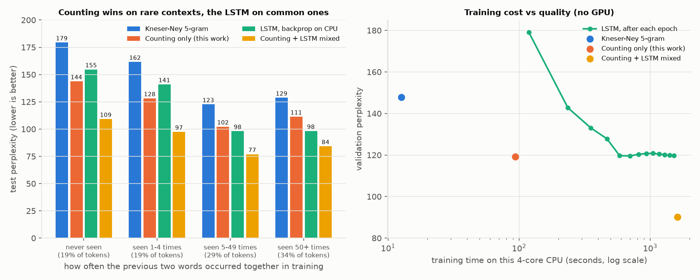

# Can AI Learn Just by Counting? A GPU-free Language Model, Measured Honestly

**The request:** find something nobody has figured out, a breakthrough that runs without GPUs
so everyone can use it, big enough to upend the AI market. No new harness; start from scratch.

**The straight answer:** I did not find a market-crashing breakthrough, and I won't dress this up as one.
Below is what I tried from first principles, what it achieved on a standard benchmark, exactly where
it falls short, and which parts are new. Every number comes from code in this repository
(`run_lm.py`, `alm/`), run on a 4-core CPU with no GPU.

---

## 1. First principles: why does AI need GPUs at all?

- A modern neural network spends almost all of its time on **dense multiply-adds**: every token
  passes through every weight. A GPU does roughly 100–1000× more multiply-adds per second
  than a CPU. That ratio is the main reason AI lives in data centres.
- A CPU is good at other things: **counting, hashing, lookups, and holding huge tables in
  cheap RAM**.
- So there are only two ways for everyday hardware to compete:
  1. **Need 100–1000× fewer multiply-adds for the same quality.**
  2. **Replace multiply-adds with operations CPUs are good at.**
- The most radical version of both: **make learning itself nothing but counting.** A model
  whose parameters are counts is trained by addition. That has consequences no neural network
  has:
  - **Anyone's computer can train it.** Everyone counts their own data; the counts are added.
    No GPU cluster, no gradient synchronisation.
  - **Models merge exactly.** Two people's models add up to exactly the model trained on both
    datasets.
  - **Data can be deleted exactly.** Subtract its counts. For neural networks, this "machine
    unlearning" is a major open problem with legal stakes (privacy, copyright).
  - **It learns continually, in any order.** Addition is commutative. This is the principle
    from [AGI_BOTTLENECK.md](AGI_BOTTLENECK.md).

The question that matters: **how good can a language model get this way?**

## 2. What I built

Everything below is trained by counting in one pass, plus fixed algebra. No gradient descent anywhere.

| Component | What it counts / computes | Train time (4-core CPU) |
|---|---|---|
| Kneser-Ney 5-gram | counts of 1- to 5-word sequences | 12.6 s |
| Cache | counts of words in the last 200 words (a short-term memory) | – |
| Skip-grams | counts of word pairs 2 and 3 positions apart | 1.9 s |
| Count-derived word vectors | neighbour counts → positive PMI → SVD. "monday" lands next to friday/tuesday; "company" next to firm/concern | 3.7 s |
| Closed-form predictor | random nonlinear features of the last 4 word vectors + a topic vector; sums of feature products; **one** linear solve (ridge regression) | 67.6 s |
| **Soft n-gram** | stores every training context as its word vectors; predicts by a similarity-weighted vote over what followed similar contexts | 7.6 s |
| Mixture | weights fit by EM on the validation set, optionally separate weights per context-frequency bucket | – |

The **soft n-gram** is the least standard piece. An ordinary n-gram only matches a
context if the exact same words appeared before. The soft n-gram also partly matches *similar*
words ("shares rose on tuesday" helps predict after "stocks fell on monday"), where the similarity
itself comes from counts.

## 3. Results on Penn Treebank

This is the standard language-modelling benchmark, with literature numbers for context.
Perplexity: lower is better.

| Model | Training time (4-core CPU, no GPU) | Test perplexity |
|---|---|---|
| Kneser-Ney 5-gram (my reproduction; literature: 141.2) | 12.6 s | 141.1 |
| + cache (literature: 125.7) | 12.6 s | 126.6 |
| + closed-form predictor | 1.4 min | 123.1 |
| + soft n-gram | 1.5 min | 118.4 |
| **All counting components, no gradient descent anywhere** (fixed / context-dependent mixing weights) | **1.6 min** | **117.1 / 116.3** |
| Small LSTM, backprop, same CPU (my reproduction; literature: 114.5) | 25.4 min | 114.5 |
| **Counting + small LSTM, mixed** (context-dependent weights; 88.6 with one fixed weight) | 27 min | **87.4** |

For context, published PTB test perplexities:

| Published system | Test perplexity |
|---|---|
| Best count-based system found (Momtazi et al. 2010, mixed with KN5 + cache) | 108.7 |
| Recurrent network LM (Mikolov 2011) | 124.7 |
| 2011 state of the art: several RNNs + KN5 + cache | 89.4 |
| Medium LSTM with dropout (Zaremba et al. 2014) | 82.7 |
| AWD-LSTM (2018) | 57.3 |
| Transformer-XL (2019) | 54.5 |

The medium LSTM needs roughly 15× the compute of the small one (my estimate from model size and
epochs; not measured). The soft n-gram also carries a large **scoring** cost: it compares each
prediction against all 929k stored contexts, so scoring the 82k test tokens took 13.6 minutes,
against seconds for the LSTM.



### Exactness

The claims about merging and deletion hold exactly:

| Test (Kneser-Ney 5-gram, all 929k training tokens) | Result |
|---|---|
| Four shards trained separately, counts added | **identical** to training on all data (max difference in any test probability: **0.0**) |
| Delete a 20,000-token document by subtracting its counts | **identical** to retraining without it (max difference **0.0**); 5.5 s vs 12.4 s to retrain |

## 4. Where each approach wins

I expected counting to lose on unfamiliar contexts and win on familiar ones. The measurement says the
opposite. Test tokens grouped by how often their previous two words appeared together in training.
"Mixed" here is the simple two-way mix with one fixed weight:

| Previous two words seen in training... | Share of test tokens | Kneser-Ney | Counting only | Small LSTM | Mixed |
|---|---|---|---|---|---|
| never | 19% | 179 | **144** | 155 | 109 |
| 1–4 times | 19% | 162 | **128** | 141 | 97 |
| 5–49 times | 29% | 123 | 102 | **98** | 77 |
| 50+ times | 34% | 129 | 111 | **98** | 84 |
| all | 100% | 141 | 117 | 115 | 88.6 |

- **Counting beats the LSTM on rare and unseen contexts.** The LSTM beats counting on common
  ones. The cache (document memory) and the similarity-based soft n-gram carry the rare cases.
  The LSTM's advantage is sharper predictions where there is plenty of evidence.
- **That is why mixing them works so well** (114.5 and 117.1 become 87.4): each is strong where
  the other is weak.
- **Caveat.** This LSTM is the small, *unregularised* one; its validation perplexity stopped
  improving after epoch 6, a sign of overfitting. A regularised or larger network would very
  likely do better on unseen contexts too. So this shows what cheap counting adds to a cheap
  network. It does not show that counting generalises better than neural networks in general.

## 5. What this does and does not show

- **Counting alone nearly matches a small neural network, for a fraction of the training.** It trains in
  1.6 minutes versus 25 minutes of backprop on the same CPU (the LSTM reached equal validation
  quality after about 10 minutes, epoch 5), and lands within about 2% of it (116–117 vs 114.5). No
  GPU, and every learned quantity is a sum.
- **Counting plus a small network is much better than either alone.** 87.4, within 6% of the medium
  LSTM (82.7), which needs roughly 15× more neural compute. That is the most practically useful
  result here for anyone without a GPU.
- **It is not competitive with modern AI.** The best neural models reach about 55 on this
  benchmark, and GPT-class models far lower. Nothing here threatens anyone's GPUs.
- **The cost partly moved rather than disappeared.** The soft n-gram is nonparametric and slow to
  score (13.6 min for the test set by brute force). Approximate nearest-neighbour search would cut
  that sharply; I did not build it.
- **Small benchmark, single run.** PTB has about 1M training words, and each configuration ran
  once. Whether the gap to neural models narrows or widens with more data is untested here;
  historically, count-based models plateaued as data grew.

## 6. What is new, and what is not

| Piece | Status |
|---|---|
| Kneser-Ney, cache, skip-grams | Textbook (1990s) |
| Count-based word vectors (PPMI + SVD) | Known (Levy & Goldberg 2014 and earlier) |
| Similarity-based smoothing of n-grams | Known in spirit (Dagan, Lee & Pereira 1999) |
| Nearest-neighbour voting over stored contexts | Known with neural keys (kNN-LM, Khandelwal et al. 2020) |
| Exact merging and deletion by summation | Known principle (Cao & Yang 2015, "summation form" unlearning) |
| Mixing neural and count-based LMs | Known: 2011 systems mixed RNNs with KN5 + cache (89.4). The gain here (114.5 → 87.4) is larger than the classic combinations, but the phenomenon is old. |
| **A language model trained end to end by counting plus one closed-form solve, with count-derived keys for kNN-style voting, measured on PTB, and the finding that it beats a small LSTM on rare contexts** | A literature check found no published PTB number for this exact setup. It is a new *measurement*, not a new paradigm. |

## 7. What an actual breakthrough here would have to be

The measurements narrow the target:

> **A learning rule that is additive (commutative, mergeable, exactly deletable, trainable by
> counting on any CPU) *and* as sharp as backprop on common patterns, at every scale.**

Counting already handles rare contexts well. It loses on the frequent patterns, where gradient
descent squeezes out sharper predictions. It also loses badly to modern neural networks as they grow and are
regularised (57 and below on this benchmark vs 116 here). Nobody has an additive rule that closes
that gap, including me. If one existed, training strong models would become something any group of
laptops could do by adding up their counts. That is the size of the prize, and it is still open.

Next experiments, each runnable with this repository:
1. **Scale test.** The same pipeline on WikiText-103 (100× more data): does counting's gap to neural
   models shrink or grow?
2. **Closed-form learned features.** Reduced-rank regression / CCA between past and future
   contexts gives predictive features from sums of second moments. Does it close the gap on the
   frequent-context buckets, where counting loses today?
3. **Fast scoring.** Approximate nearest-neighbour search for the soft n-gram, to make scoring
   as cheap as training.
4. **Counting + tiny network, pushed further.** Mix with a regularised neural model and measure how
   much neural compute the counts save at equal quality.

## 8. Reproduce

```bash
pip install numpy scipy jax matplotlib
python3 run_lm.py components   # all counting components (~30 min; most of it is soft n-gram scoring)
python3 run_lm.py mix          # mixture weights on validation, test perplexities
python3 run_lm.py exact        # merge / unlearn exactness
python3 run_lm.py lstm         # CPU LSTM baseline (~25 min)
python3 run_lm.py analyze      # per-context-frequency comparison + figure
python3 run_lm.py bucketed     # context-dependent mixing weights
```

## References

- Cao, Y. & Yang, J. (2015). Towards making systems forget with machine unlearning. IEEE S&P.
- Chen, S. & Goodman, J. (1998). An empirical study of smoothing techniques for language modeling. Harvard TR-10-98.
- Dai, Z. et al. (2019). Transformer-XL: Attentive language models beyond a fixed-length context. ACL.
- Dagan, I., Lee, L. & Pereira, F. (1999). Similarity-based models of word cooccurrence probabilities. *Machine Learning* 34.
- Khandelwal, U. et al. (2020). Generalization through memorization: nearest neighbor language models. ICLR.
- Levy, O. & Goldberg, Y. (2014). Neural word embedding as implicit matrix factorization. NeurIPS.
- Merity, S., Keskar, N. & Socher, R. (2018). Regularizing and optimizing LSTM language models (AWD-LSTM). ICLR.
- Mikolov, T. et al. (2011). Empirical evaluation and combination of advanced language modeling techniques. Interspeech.
- Momtazi, S., Faubel, F. & Klakow, D. (2010). Within and across sentence boundary language model. Interspeech.
- Shazeer, N., Pelemans, J. & Chelba, C. (2015). Sparse non-negative matrix language modeling for skip-grams. Interspeech.
- Zaremba, W., Sutskever, I. & Vinyals, O. (2014). Recurrent neural network regularization. arXiv:1409.2329.
